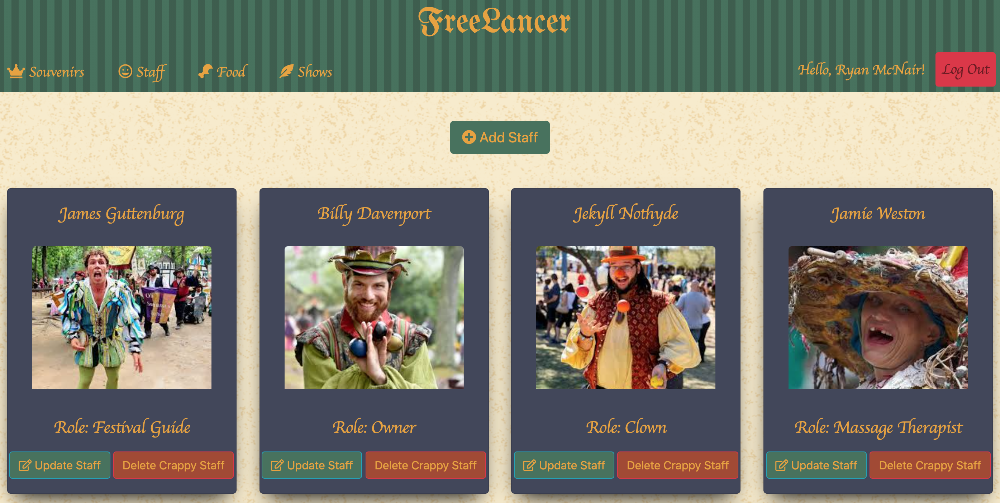
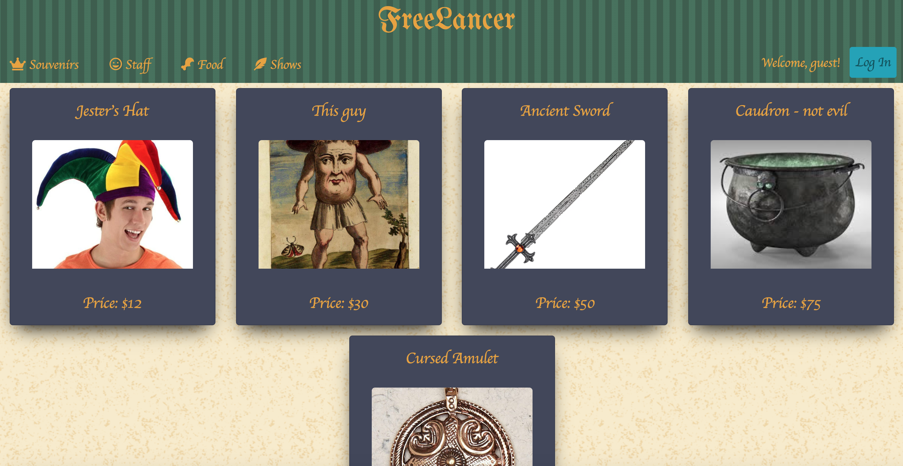

# Renaissance Fair Dashboard
##### Week 1



##### Week 2-3


## ERD
##### Week 1
https://app.lucidchart.com/invitations/accept/61661407-ead2-482d-a0df-77b47ac389f2

##### Week 2-3


## Wireframe
##### Week 1
https://www.figma.com/file/Roh46wOW21lSTYFBbRW1xo/FreeLancer?node-id=15%3A4

##### Week 2-3
https://www.figma.com/file/dVczHuXR4uxTSJ9eqCel4l/Freelancer-Wireframe?node-id=0%3A1

## Link to the project
##### Week 1
[View Deployed Site Here](https://freelancers-7ae52.web.app/)

##### Week 2-3
[View Deployed Site Here](https://freelancer-f77ce.web.app/)

# Nutshell - FreeLancers
##### Week 1
Nutshell/FreeLancers is an app that allows authorized users to create, modify, and delete different types of data; unauthorized users may still view the site and read the listed items/data, however they are unable to make any changes to the data. FreeLancers specifically provides different dashboards/modules for the authorized users to edit and manage for local Renaissance Faires to keep everything running smoothly. 

##### Week 2-3
The Second Team to inherit this project had the job of setting up a page for "Events" of the Renaissance Fair, which was to include Staff, Shows, Souvenirs, and Food. The challenge was to be able to be able to have full CRUD functionality on all of these things and be able to see a details view that included prices and totals for each section/event. We used a third party application AmCharts to dynamically show the financial stats of each event by sections and by the totals of each event.

## Motivation

##### Week 1
This app seeks to practice basic CRUD (Create, Read, Update, Delete) functionality, resolving promises, and manipulating Firebase hosted data. 

##### Week 2-3
The Motivation was to manipulate data on a deeper level, we used intermediary tables to store our data using firebase and had the challenge of tying different items to a certain event whithout hard coding it into that event. We also had to use Javascript Promises to wait on the various API calls to be complete before manipulating the DOM.

## Code

This project utilizes CSS, HTML5, and ES6 Javascript. 

## Framework

Javascript + supporting HTML & CSS

## Features

##### Week 1
FreeLancers opens with the souvenirs page, which will display all currently available souvenirs and their prices. Upon logging in and being authorized, users are able to manipulate this data as they see fit: changing current products, adding new products, and getting rid of old products. Each link across this dashboard (souvenirs, staff, shows, and food) has the same level of functionality and authorized users are capable of editing all of this data. 

##### Week 2-3
The user is now able to add Events that include Food, Souvenirs, Staff, and Shows. The user is able to Add, Edit, Delete, and View each item in the event, read all the total costs of each section and the total of the events, and is able to view on a responsive graph all the data off the costs.

## Code Snippet


##### Week 1
Below is a snippet of code that adds the authorized user functionalities to the page. When the auth state of the user changes, it writes new buttons to the cards on each module. Buttons are only present and data is only able to be edited if user is logged in. This is the sample from our food module.

```
const addButtonsIfUserIsLoggedIn = (foodObject) => {
  firebase.auth().onAuthStateChanged((user) => {
    if (user) {
      $(`.button-body-${foodObject.firebaseKey}`).html(
        `<a href='#' id="${foodObject.firebaseKey}"
        class="update-food btn btn-info"><i class="far fa-edit"></i> Update food</a>
        <a href="#" id="${foodObject.firebaseKey}" class="btn btn-danger delete-food">Delete food</a>`
      );
      $('#add-button').html(
        `<div id="add-food">
           <a href='#'
           class="add-food btn btn-primary btn-lg"><i class="fas fa-plus-circle"></i> Add Food</a>
        </div>`
      );
      $('body').on('click', '.delete-food', (e) => {
        e.stopImmediatePropagation();
        const firebaseKey = e.currentTarget.id;
        $(`.card#${firebaseKey}`).remove();
        foodData.deleteFood(firebaseKey);
      });
    }
  });
};

```
##### Week 2-3
Here is an example of how we used Promise.all in various places to wait on all promises to be resolved for the total prices of each section to be displayed.

```
const showsTotalPrices = (eventFirebaseKey) => new Promise((resolve, reject) => {
  let showsTotal = 0;
  getEventShows(eventFirebaseKey)
    .then((showsArray) => Promise.all(showsArray.map((shows) => showData.getSingleShow(shows.showUid))))
    .then((showsObjects) => showsObjects.forEach((show) => {
      showsTotal += parseInt(show.price, 10);
    }))
    .then(() => resolve(showsTotal))
    .catch((error) => reject(error));
});

const allTheTotalPromises = (eventFirebaseKey) => Promise.all([
  eventFood.foodTotalPrices(eventFirebaseKey),
  eventShows.showsTotalPrices(eventFirebaseKey),
  eventSouvenirs.souvenirsTotalPrices(eventFirebaseKey),
  eventStaff.staffTotalPrices(eventFirebaseKey),
]);
```
# The Teams
##### Week 1
[Ryan Mcnair](https://github.com/ryanmcnair)
[Summer Duke](https://github.com/esrduke95)
[Jonathan Joyner](https://github.com/Jonathon22)
[Sam Mudick](https://github.com/smudick)

##### Week 2-3
[Chris LoJacono](https://github.com/chrislojacono)
[Kaitlyin Vanhook](https://github.com/kaitvan)
[Liz Barnes](https://github.com/liz-barnes)
[Joseph Martin](https://github.com/josephtmartin)
